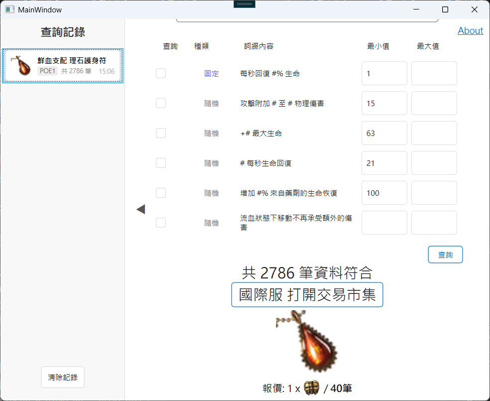
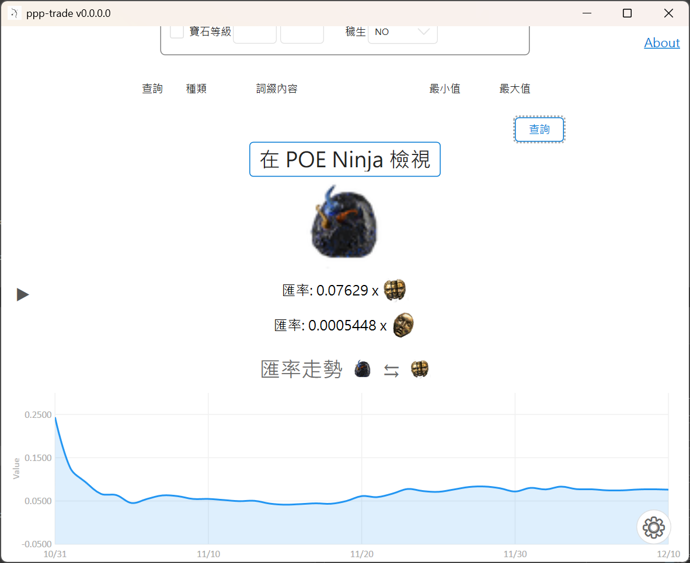

# PPP-Trade

PPP-Trade 是一個為了 Path of Exile (POE1 & POE2) 設計的查價工具，旨在提供快速、便捷的物品價格查詢體驗。

## ✨ 主要功能

- **多版本支援**：同時支援 Path of Exile 1 (POE1) 與 Path of Exile 2 (POE2)。
- **多服務器支援**: 同時支援台服與國際服。
- **中文及英文版支援**: 支援中文化後的遊戲及英文版的遊戲。
- **剪貼簿監聽**：複製遊戲內物品資訊 (Ctrl+C)，程式自動解析道具類型及其詞綴。
- **通貨匯率走勢**：
  - 針對通貨查詢，顯示即時匯率。
  - 整合歷史匯率圖表，視覺化呈現價格波動。
- **歷史查詢記錄**：
  - 側邊欄自動記錄最近的查詢結果。
  - 點擊記錄可快速還原先前的查價結果。
- **進階過濾器**：
  - 可自訂過濾條件：腐化狀態 (Corrupted)、物品等級 (Item Level)、插槽數量/連線 (Sockets/Links)。
  - 支援 POE2 特有的過濾選項 (如符文插槽)。

## ⌨️ 快捷鍵

- **Ctrl + C**:
  - 遊戲內建複製功能。
  - 主程式會監聽剪貼簿，自動偵測並解析複製的物品資訊。

- **Ctrl + D**: 
  - 在遊戲中按下此組合鍵，自動複製游標下的物品資訊。
  - 透過浮動視窗 (Overlay) 快速顯示查價結果或匯率資訊。
  - 滑鼠移出浮動視窗範圍或點擊其他區域時自動關閉，適合快速瀏覽。

- **Ctrl + Alt + D**:
  - 在遊戲中按下此組合鍵，自動複製游標下的物品資訊。
  - 喚起主視窗並填入物品資訊，顯示詳細的篩選條件與搜尋結果。
  - 適合需要調整詳細過濾條件 (如詞綴數值範圍) 時使用。

## 🚀 快速開始

1.  下載並執行最新版本的 `ppp-trade.exe`。
2.  選擇遊戲版本 (POE1 / POE2) 與伺服器 (台服 / 國際服)。
3.  選擇所屬聯盟 (League)。
4.  在遊戲中將滑鼠游標停在物品上：
    - 按下 `Ctrl + D` 開啟快速查價浮動視窗。
    - 按下 `Ctrl + Alt + D` 喚起主程式視窗進行詳細查詢。
    - 或按下 `Ctrl + C` 複製物品資訊，程式將自動偵測並解析。

## 📚 參考資料

- 本程式中文部分的道具資訊皆源於 [POE 編年史](https://poedb.tw/tw/)
- 通貨匯率資料來源於 [POE ninja](https://poe.ninja/)
